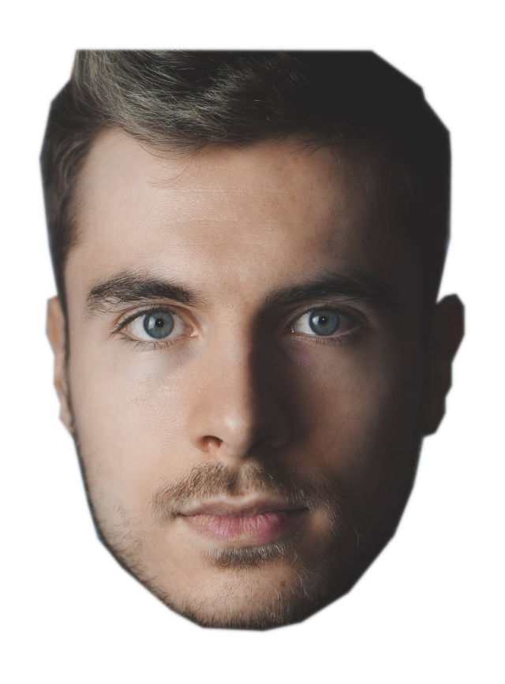

# Gimpify

This repository is intended for creating automatic montages: it pastes
faces onto others faces. That's about it.

## DISCLAIMER
- The aim of this package is not to make it beautiful, it is to make
it a nightmare
- I know there is still room for improvement on the maths for pasting 
images. I will work on it when I have time. Help appreciated! 

## Installation
```bash
pip3 install gimpify-watxaut
```
This package uses [face-recognition](https://github.com/ageitgey/face_recognition) 
from Adam Geitgey to get the faces and 
[pillow](https://pillow.readthedocs.io/en/stable/) to modify and paste 
them. Both get installed when installing this package.

## How to run?
### 1. Search for your images
First, you will need two separate folders, one with 'backgrounds' 
and another with 'faces'. When I talk about backgrounds I mean 
photographs with people AND faces visible. In fact, only the faces are
needed, no need to show any other part of the body. One example of
background:


When I talk about faces, I mean PNG images with only the face visible, 
like this one:


When you have this two folders populated, you are ready to start the
second phase.

### 2.1 The fast approach
If you need to test the power of this package fast, you can do the 
following:
```python
import gimpify
montages_path = "path/out/montages"
path_to_faces_folder = "path/to/folder/faces"
path_to_backgrounds_folder = "path/to/folder/backgrounds"
montage_file_path = gimpify.create_random_montage(montages_path, path_to_backgrounds_folder, path_to_faces_folder)
```

In the montage_file_path variable will be the path to your newly created
montage. This will create a json file inside the images paths so that
the next time will try to get the json instead of loading again the 
images.
CAUTION: if you put new images, you will need to erase the json to
force the creation again.
 

### 2.2: create_face_json and create_background_json
If you are more sophisticated, you can create both json files with 
the face parameters before creating a montage, so if you put new images
programmatically you can recreate this json files and use this new 
images right away.

The following code will get the aforementioned done:
```python
import gimpify
path_to_faces_folder = "path/to/folder/faces"
path_to_backgrounds_folder = "path/to/folder/backgrounds"
json_faces = "path/to/json/faces.json"
json_backgrounds = "path/to/json/backgrounds.json"
gimpify.create_face_json(path_to_faces_folder, path_to_faces_folder)
gimpify.create_background_json(path_to_backgrounds_folder, path_to_backgrounds_folder)
```

Then use this paths to both jsons to create random images. You have now 
3 different options regarding the way you want your montages:

#### 2.2.1 Use gimpify.create_random_montage
We saw this method early on, but it's worth mentioning. It takes 4
arguments:

* :param montage_folder_path: {str} folder to save the montage
* :param b_path: {str} folder background path or json path with the face params. If folder provided, the 'backgrounds.json' file
    will be created inside the backgrounds' folder. If json provided, it will use the json to load the params (faster)
* :param f_path: {str} folder face path or json path with the face's params. If folder provided, the 'faces.json' file
    will be created inside the faces' folder. If json provided, it will use the json to load the params (faster)
* :param only_face: {bool}. False by default. Will leave hair and chin if False, else will crop the face

The use for this one is the following:
```python
import gimpify
json_faces = "path/to/json/faces.json"
json_backgrounds = "path/to/json/backgrounds.json"
montage_folder_path = "path/out/montages"
only_face = False
path_to_new_image = gimpify.create_random_montage(montage_folder_path, json_backgrounds, json_faces, only_face)
```

This way, the module does not create the json params again and thus 
increasing the speed of the creation.

#### 2.2.2 Use gimpify.create_montage_for_background
Use this method if you want to create a montage for a background of your
pleasing, a new photograph that you just made or you need a fast 
processing for just a background and you don't need to process all the
others. E.g.: you send a selfie to a bot and the bot answers with a
montage. It takes 4 arguments:

* :param montage_folder_path: {str} folder to save the montage
* :param im_b_path: {str} with the background image path
* :param f_path: {str} folder face path or json path with the face's params. If folder provided, the 'faces.json' file
    will be created inside the faces' folder
* :param only_face: {bool} Whether to crop the hair and chin of the face or not

```python
import gimpify
json_faces = "path/to/json/faces.json"
im_b_path = "path/to/background_image.png"
montage_folder_path = "path/out/montages"
only_face = False
path_to_new_image = gimpify.create_montage_for_background(montage_folder_path, im_b_path, json_faces, only_face)
```

#### 2.2.3 Use gimpify.create_montage
This method is the lowest level available and it returns a PIL Image. It takes in 3 arguments:
* :param im_background: {str, dict} str if is an image path or dict if it comes from a json read from a background's folder
* :param json_faces: {dict} json read with all the information about the faces' parameters
* :param only_face: {bool}. False by default. Will leave hair and chin if False, else will crop the face

-> Returns a PIL Image.Image variable with the image for you to do
whatever you want.

The use is the following one:
```python
import gimpify
import json

f_faces = open("path/to/json/faces.json", "r")
json_faces: dict = json.load(f_faces)
f_faces.close()
im_background = "path/to/background_image.png"
only_face = False
path_to_new_image = gimpify.create_montage(im_background, json_faces, only_face)
```
